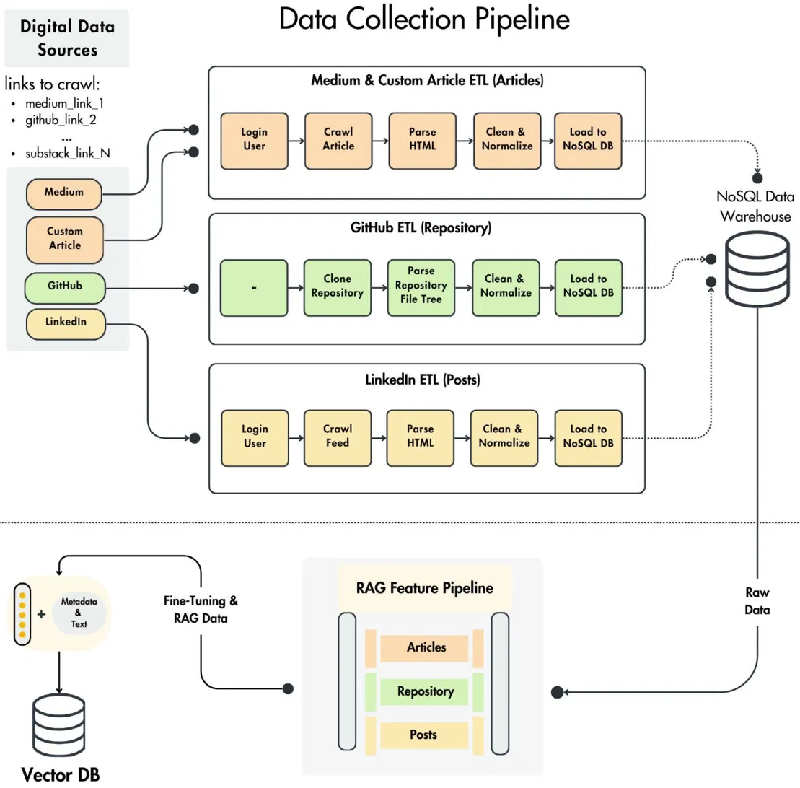
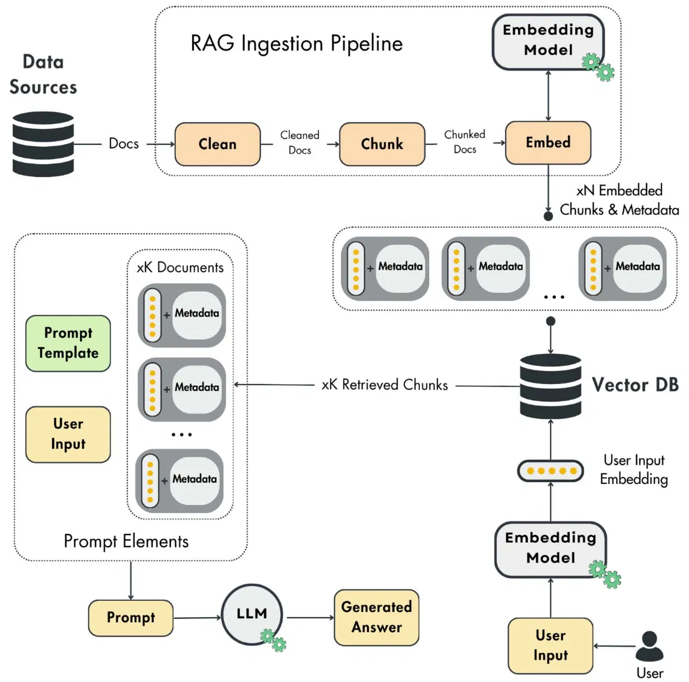
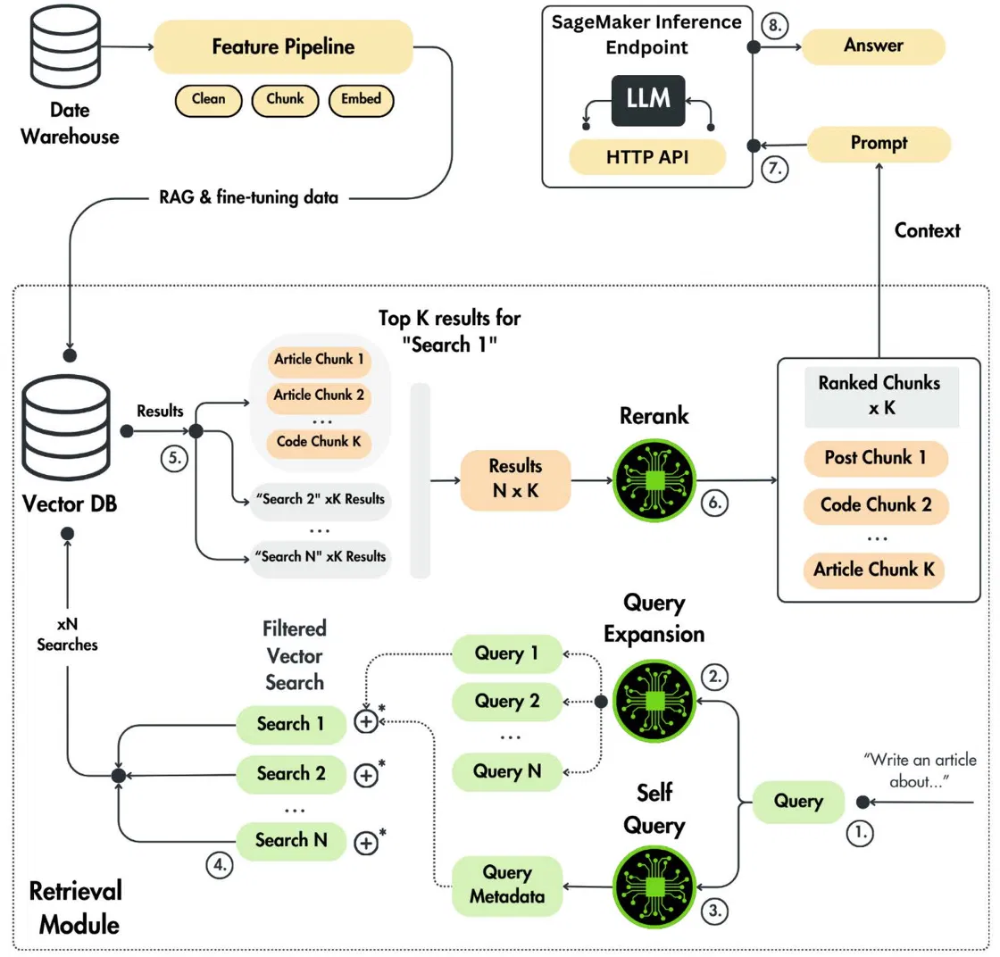
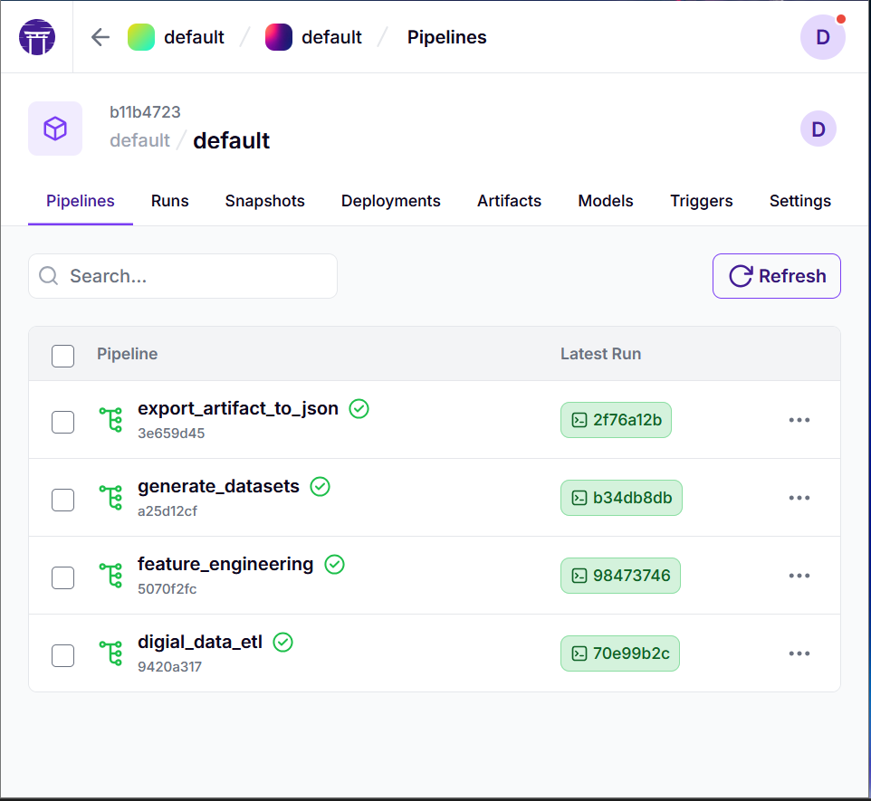
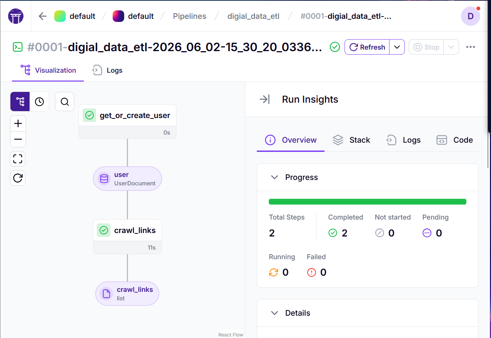
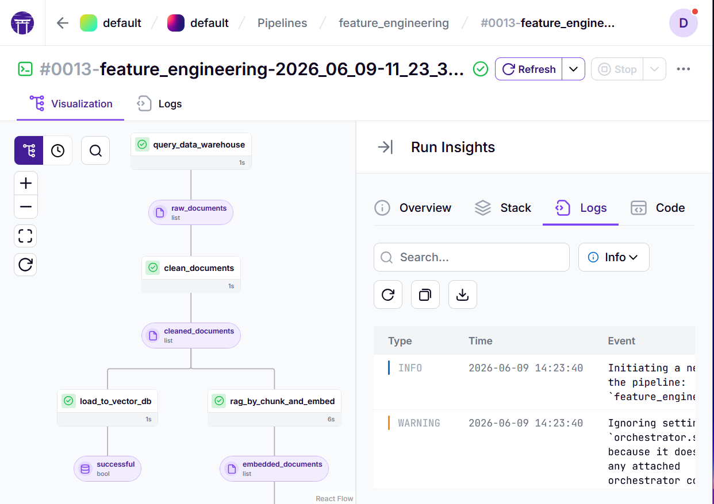
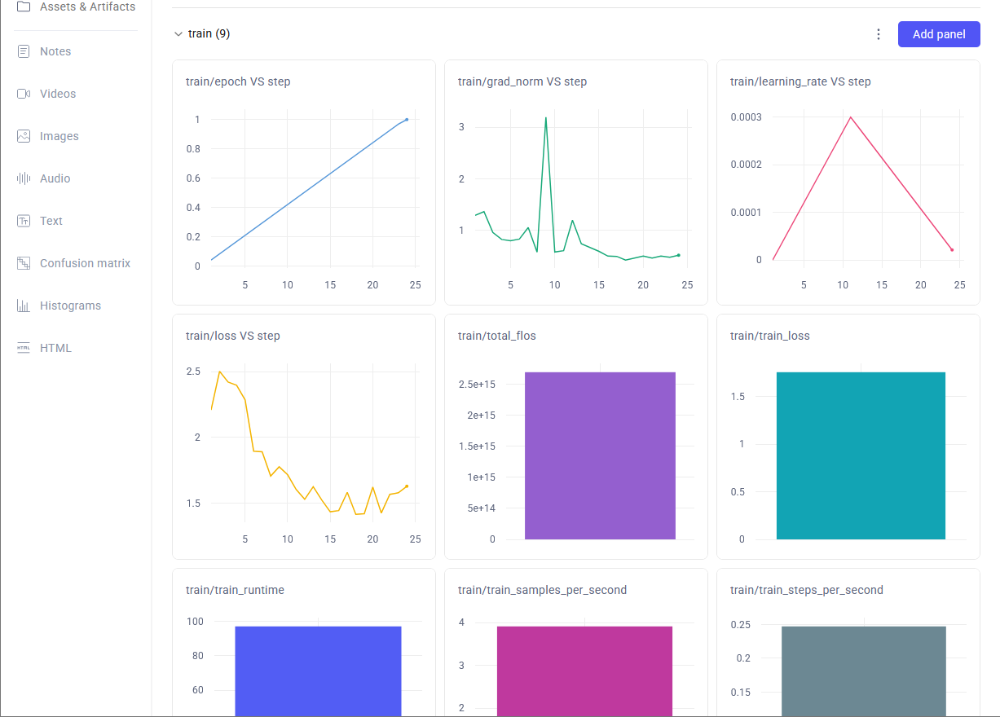
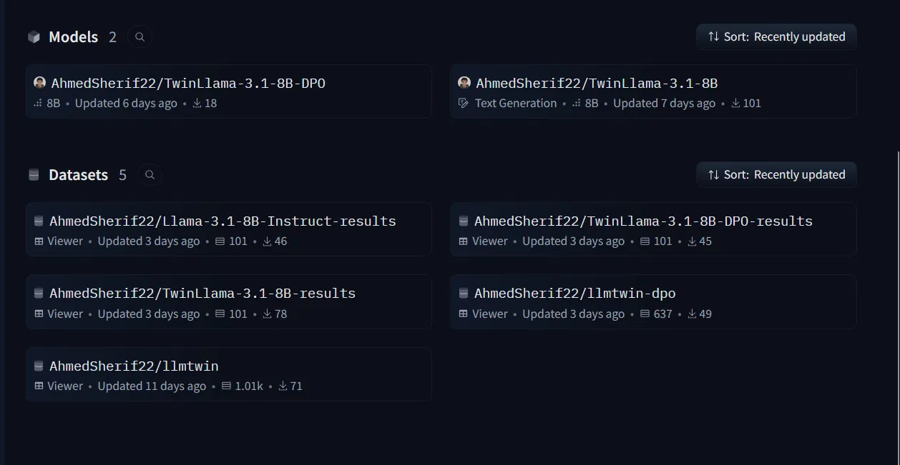
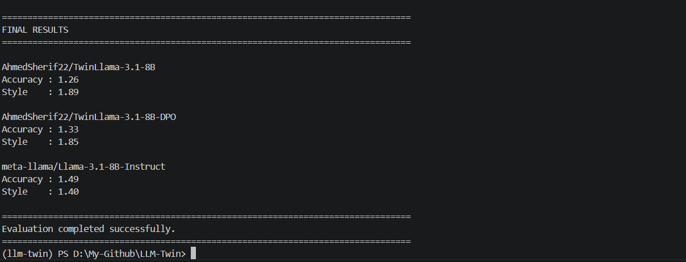
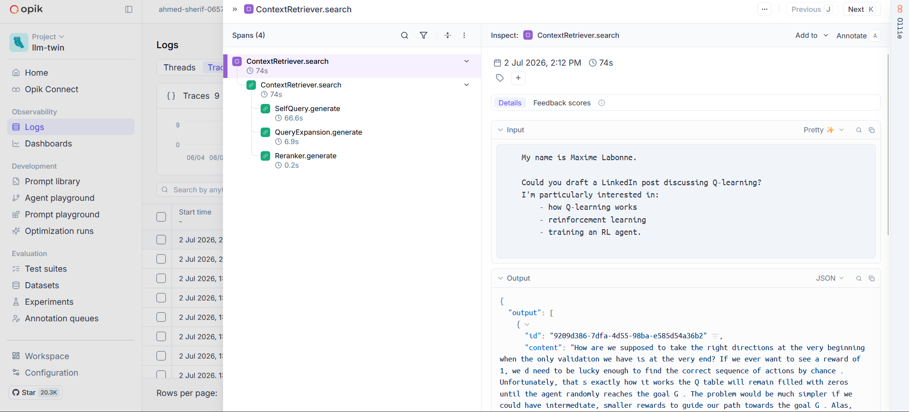

# PersonaLLM — Your Digital Writing Twin

> **Train a language model on your own writing. Deploy a model that thinks, writes, and communicates like you.**

[](https://www.python.org/)
[](https://huggingface.co/AhmedSherif22)
[](https://zenml.io/)
[](https://www.comet.com/)
[](#)

---

## Overview

**PersonaLLM** (internal codename: *LLM-Twin*) is an end-to-end system for building a **digital writing twin** — a fine-tuned language model that mirrors your personal writing style and voice.

The project collects your existing content (blog posts, GitHub activity, LinkedIn articles, notes), processes it through structured data pipelines, uses that data to fine-tune a base LLM (Llama 3.1-8B), and serves the resulting model via a production-grade inference endpoint — complete with RAG-powered retrieval, LLM observability, and evaluation tooling.

The result is a model that doesn't just know facts — it knows *how you write*.

---

## Key Features

- **Automated data collection** from Medium, GitHub, LinkedIn, and custom article sources
- **Feature engineering pipeline** — clean, chunk, embed, and index your content into a vector database for RAG
- **Supervised Fine-Tuning (SFT)** on your personal writing corpus using Llama 3.1-8B as the base
- **Direct Preference Optimization (DPO)** for further style alignment beyond SFT
- **Advanced RAG** at inference time — query expansion, self-query filtering, vector search, and reranking
- **ZenML orchestration** for all pipeline stages with full run visibility and artifact tracking
- **Opik LLM tracing** for span-level observability into every inference call
- **W&B integration** for training metrics and experiment tracking
- **Dockerized** for local development; Kubernetes manifests for production deployment
- **Published models on Hugging Face Hub** — ready to pull and run

---

## Architecture

PersonaLLM is composed of four major stages:

```
Personal Content Sources (Medium, GitHub, LinkedIn, Articles)
        │
        ▼
[ Stage 1: Data Collection (ETL) ] ──► NoSQL Data Warehouse
        │
        ▼
[ Stage 2: Feature Engineering ] ──► Vector Database (RAG Index)
        │
        ▼
[ Stage 3: Fine-Tuning (SFT → DPO) ] ──► Hugging Face Hub
        │
        ▼
[ Stage 4: Inference / Serving (SageMaker Endpoint + RAG) ]
```

### Stage 1 — Data Collection (ETL)

The digital data ETL pipeline collects content from multiple personal sources and loads it into a structured NoSQL data warehouse, which feeds all downstream feature pipelines.



---

### Stage 2 — Feature Engineering & RAG Ingestion

Raw documents are cleaned, chunked, embedded, and loaded into a vector database. At query time, the same index powers the RAG retrieval flow.





The RAG retrieval architecture includes:
- **Query expansion** — generate multiple query variants to improve recall
- **Self-query filtering** — extract metadata filters directly from the user query
- **Filtered vector search** — semantic search scoped by metadata constraints
- **Reranking** — cross-encoder reranking of top candidates before generation
- **SageMaker inference endpoint** — final generation grounded by retrieved context

---

### Stage 3 — Fine-Tuning

The processed data is used to fine-tune `meta-llama/Llama-3.1-8B-Instruct` in two stages:

1. **SFT** — supervised fine-tuning on writing samples to learn style and tone
2. **DPO** — preference optimization to further refine output quality and style fidelity

---

### Stage 4 — Serving

The fine-tuned model is deployed to a SageMaker (or compatible) inference endpoint. Incoming queries are augmented with retrieved context from the vector DB before being passed to the model.

---

## Project Structure

```
PersonaLLM/
├── llm_twin/                  # Core application library (models, utilities, shared logic)
├── pipelines/                 # ZenML pipeline definitions (ETL, feature engineering, training, inference)
├── services/                  # Serving and inference service implementations
├── deployment/
│   └── manifests/             # Kubernetes deployment manifests
├── scripts/                   # Helper and utility scripts
├── tests/                     # Test suite
├── data/
│   └── images/                # Architecture diagrams and screenshots
├── Dockerfile                 # Container image definition
├── docker-compose.yaml        # Local multi-service orchestration
├── pyproject.toml             # Python project metadata and dependencies
├── uv.lock                    # Locked dependency tree (managed by uv)
└── .env.example               # Environment variable template
```

---

## Getting Started

### Prerequisites

- Python 3.11+
- [uv](https://docs.astral.sh/uv/) (recommended) or pip
- Docker & Docker Compose
- A running ZenML server (local or remote)
- Access credentials for your data sources and cloud services (see `.env.example`)

### Installation

**Using uv (recommended):**

```bash
git clone https://github.com/AhmedSherif22/PersonaLLM.git
cd PersonaLLM
uv sync
```

**Using pip:**

```bash
git clone https://github.com/AhmedSherif22/PersonaLLM.git
cd PersonaLLM
pip install -e .
```

### Environment Setup

Copy the example environment file and fill in your credentials:

```bash
cp .env.example .env
```

Open `.env` and configure the required variables. See the [Configuration](#configuration) section for a full breakdown.

### Running with Docker

Start all services locally using Docker Compose:

```bash
docker compose up --build
```

For a standalone container:

```bash
docker build -t personalllm .
docker run --env-file .env personalllm
```

---

## Running the Pipelines

All pipelines are orchestrated with **ZenML**. Start by connecting to your ZenML server:

```bash
uv run zenml login --local --blocking
```

### Available Pipelines

| Pipeline | Description |
|---|---|
| `digital_data_etl` | Collects and loads personal content into the data warehouse |
| `feature_engineering` | Cleans, chunks, embeds, and indexes content into the vector DB |
| `generate_datasets` | Generates fine-tuning datasets from processed features |
| `export_artifact_to_json` | Exports ZenML artifacts to JSON for inspection |



### Running a Pipeline

```bash
# Example — run the ETL pipeline
uv run python pipelines/<etl_pipeline_entrypoint>.py
```

> **Placeholder:** Replace `<etl_pipeline_entrypoint>.py` with the actual pipeline script filename.

**Digital Data ETL pipeline run:**



**Feature Engineering pipeline run (clean → embed → load to vector DB):**



---

## Fine-Tuning & Models

### Training

Fine-tuning runs in two stages using the dataset produced by the feature engineering pipeline.

**Stage 1 — Supervised Fine-Tuning (SFT):**

```bash
uv run python pipelines/<sft_training_pipeline>.py
```

**Stage 2 — Direct Preference Optimization (DPO):**

```bash
uv run python pipelines/<dpo_training_pipeline>.py
```

> **Placeholder:** Replace the script names above with your actual pipeline entrypoints.

Training metrics (loss, gradient norm, learning rate schedule) are tracked in **Weights & Biases**:



### Published Models

Both fine-tuned models are publicly available on Hugging Face Hub:

| Model | Description | Link |
|---|---|---|
| `AhmedSherif22/TwinLlama-3.1-8B` | SFT writing twin | [🤗 View on Hub](https://huggingface.co/AhmedSherif22/TwinLlama-3.1-8B) |
| `AhmedSherif22/TwinLlama-3.1-8B-DPO` | DPO-refined writing twin | [🤗 View on Hub](https://huggingface.co/AhmedSherif22/TwinLlama-3.1-8B-DPO) |



To pull a model locally:

```python
from transformers import AutoModelForCausalLM, AutoTokenizer

model_id = "AhmedSherif22/TwinLlama-3.1-8B-DPO"
tokenizer = AutoTokenizer.from_pretrained(model_id)
model = AutoModelForCausalLM.from_pretrained(model_id)
```

---

## Evaluation & Results

Models are evaluated across two dimensions:

- **Accuracy** — how factually grounded and coherent the output is
- **Style** — how closely the output matches the target writing style and voice

> **Note on metric direction:** Please confirm whether lower or higher scores are preferred for each metric before publishing. The interpretation below assumes **lower Accuracy is better** (less deviation from ground truth) and **higher Style is better** (closer match to target voice) — adjust the interpretation if the direction differs.

### Results

| Model | Accuracy | Style |
|---|---|---|
| `meta-llama/Llama-3.1-8B-Instruct` (baseline) | 1.49 | 1.40 |
| `AhmedSherif22/TwinLlama-3.1-8B` (SFT) | 1.26 | 1.89 |
| `AhmedSherif22/TwinLlama-3.1-8B-DPO` (DPO) | 1.33 | 1.85 |

**Interpretation:**
- The SFT twin substantially improves style fidelity over the base model (+0.49), while also improving accuracy — demonstrating that fine-tuning on personal writing transfers meaningful signal.
- DPO refinement slightly trades style for a small accuracy improvement, suggesting preference optimization nudges the model toward more grounded outputs while preserving most of the style gains.
- Both fine-tuned models significantly outperform the base Llama 3.1-8B on style — the core objective of a writing twin.



---

## Observability & Monitoring

All inference calls are traced end-to-end using **Opik**, providing span-level visibility into context retrieval, query expansion, reranking, and final generation.



Configure Opik tracing via the relevant keys in your `.env` file (see `.env.example`). Traces are automatically attached to every pipeline run and live inference request.

---

## Usage Examples

Once the inference endpoint is running, query your writing twin:

```python
import requests

response = requests.post(
    "<your_inference_endpoint_url>",
    json={
        "query": "Write a short introduction about the importance of open-source AI.",
        "use_rag": True,
    },
    headers={"Authorization": "Bearer <your_api_key>"},
)

print(response.json()["generated_text"])
```

> **Placeholder:** Replace `<your_inference_endpoint_url>` and `<your_api_key>` with your actual endpoint URL and credentials.

---

## Configuration

All configuration is driven by environment variables. Copy `.env.example` to `.env` and fill in the values:

```bash
cp .env.example .env
```

Key configuration areas:

| Variable Group | Purpose |
|---|---|
| Data source credentials | API keys for Medium, LinkedIn, GitHub |
| Vector DB connection | Host, port, and collection name for the vector store |
| ZenML server | Server URL and API token |
| W&B | Project name and API key for training tracking |
| Opik | API key and workspace for LLM tracing |
| Hugging Face | Token for pushing/pulling models and datasets |
| SageMaker / inference | Endpoint URL, region, and IAM credentials |

For production deployments, review `deployment/manifests/` for Kubernetes ConfigMap and Secret templates corresponding to each variable group.

---

## Testing

Run the full test suite:

```bash
uv run pytest tests/
```

Run a specific test module with verbose output:

```bash
uv run pytest tests/<module_name>.py -v
```

> **Placeholder:** Add documentation for any required environment setup or test fixtures here.

---

## Roadmap

- [ ] Support additional data sources (Notion, Substack, Twitter/X)
- [ ] Multi-user support — manage writing twins for multiple authors
- [ ] Automated evaluation pipeline triggered on each training run
- [ ] Streaming inference API
- [ ] Web UI for interacting with the writing twin
- [ ] RLHF loop — collect feedback from served model outputs to improve future fine-tuning rounds

---
